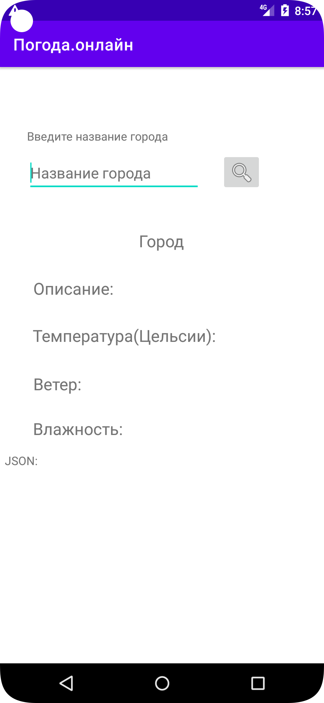
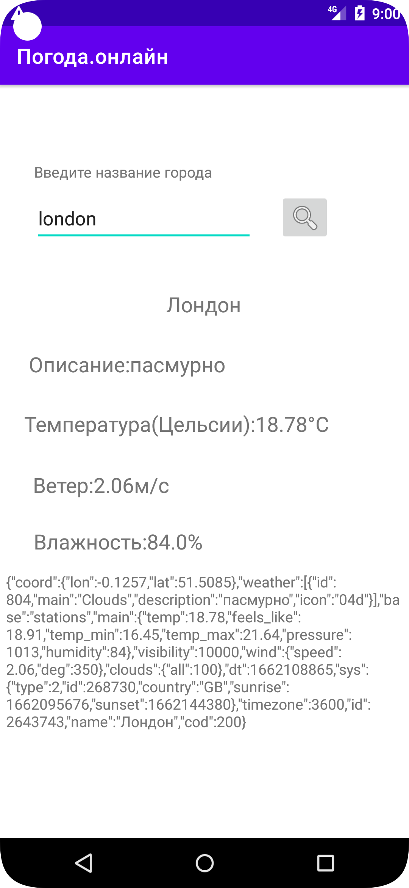

# OnlineGetWeatherAndroid

Application to send request to api weather and get answer

Documentation(Dozywizard): https://catonearth.github.io/OnlineGetWeatherAndroid/html/

    Screenshot main activity:  

    

    Screenshot main weather activity:  

    

